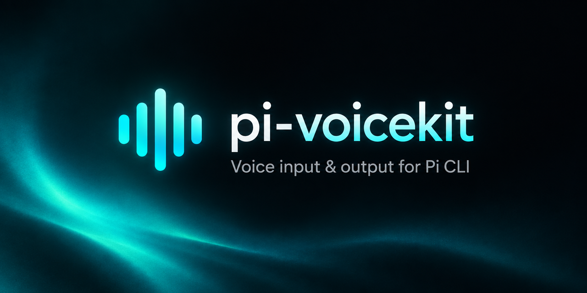
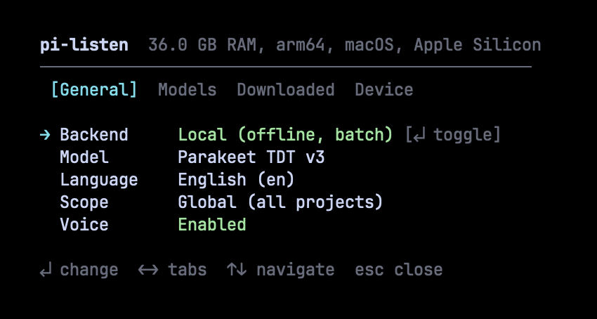
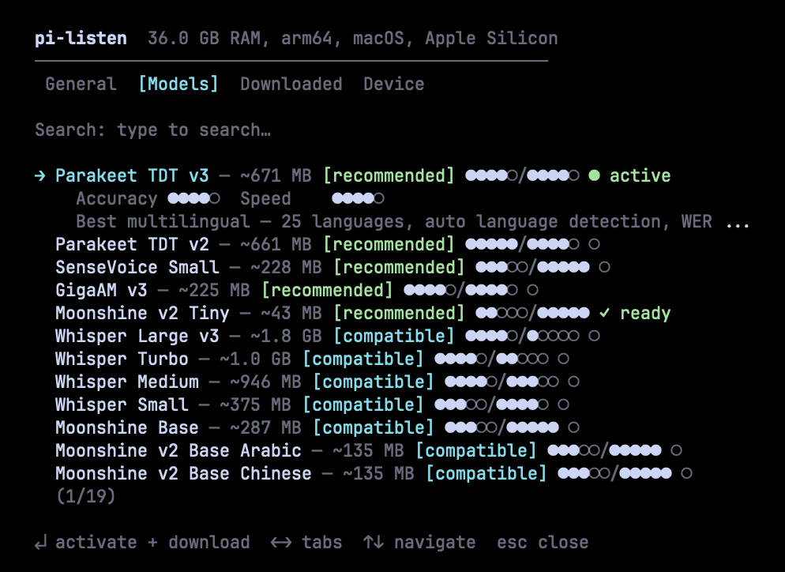
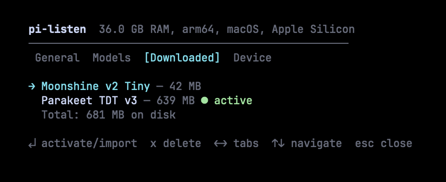
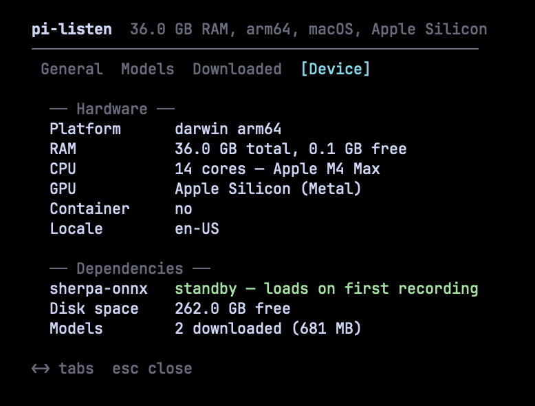

[English](../README.md) | [简体中文](README.zh-CN.md) | [日本語](README.ja.md) | [한국어](README.ko.md) | [Español](README.es.md) | [Français](README.fr.md) | [Português](README.pt-BR.md) | [हिन्दी](README.hi.md)

# pi-voicekit

> **Continuación comunitaria de [`codexstar69/pi-listen`](https://github.com/codexstar69/pi-listen)** (upstream, MIT — inactivo desde la v7.2.2 en mayo de 2026).
> Sin afiliación con el autor original. Nombre anterior: `pi-listen`.

<p align="center">
  
</p>

**Voz de entrada y voz de salida para [Pi](https://github.com/earendil-works/pi-coding-agent).**
STT de mantener-para-hablar — streaming de Deepgram (nube) u 21 modelos sin conexión — más TTS que
lee en voz alta las respuestas del agente (Kitten, Kokoro, Piper o Deepgram Aura).

[](https://www.npmjs.com/package/pi-voicekit)
[](https://github.com/CyFeng16/pi-voicekit/blob/main/LICENSE)
[](https://x.com/baanditeagle)

> **v0.1.3 — versión actual** — la captura de audio prefiere `ffmpeg` cuando
> `PULSE_SERVER` está definida (túnel de audio por SSH / PulseAudio remoto), de modo
> que los micrófonos remotos graban de forma fiable. Voz de entrada **y** de salida:
> 21 modelos STT sin conexión, 20 voces TTS locales más Deepgram Aura, controlados por
> un único panel `/voice-settings` con 6 pestañas. La línea 0.1.x está documentada en el
> [registro de cambios](../CHANGELOG.md).

---

## Mira cómo funciona

<p align="center">
  <video src="../assets/demo/pi-voicekit-demo.mp4" controls width="100%"></video>
  <br>
  <em>Vídeo de demostración</em>
</p>

---

## Configuración (2 minutos)

### 1. Instala la extensión

```bash
# En una terminal normal (no dentro de Pi)
pi install npm:pi-voicekit
```

### 2. Elige tu backend

pi-voicekit admite dos backends de transcripción:

|                   | Deepgram (nube)                                                               | Modelos locales (sin conexión)                                           |
| ----------------- | ----------------------------------------------------------------------------- | ------------------------------------------------------------------------ |
| **Cómo funciona** | Streaming en vivo — el texto aparece mientras hablas                          | Modo por lotes — transcribe cuando terminas de grabar                    |
| **Configuración** | Se requiere clave de API                                                      | Sin clave de API, los modelos se descargan automáticamente al primer uso |
| **Internet**      | Necesario                                                                     | No es necesario tras descargar el modelo                                 |
| **Latencia**      | Resultados intermedios en tiempo real                                         | 2–10 segundos tras detener la grabación                                  |
| **Idiomas**       | 56+ con streaming en vivo                                                     | Depende del modelo (1–57 idiomas)                                        |
| **Costo**         | $200 de crédito gratuito (dura 6–12 meses para la mayoría de desarrolladores) | Gratis para siempre                                                      |

Ejecuta `/voice-settings` dentro de Pi para elegir tu backend y configurarlo todo desde un único panel.

#### Opción A: Deepgram (recomendado para streaming en vivo)

Regístrate en [dpgr.am/pi-voice](https://dpgr.am/pi-voice) — $200 de crédito gratuito, sin tarjeta.

```bash
export DEEPGRAM_API_KEY="your-key-here"    # añádelo a ~/.zshrc o ~/.bashrc
```

#### Opción B: Modelos locales (totalmente sin conexión)

No hace falta configurar nada — ejecuta `/voice-settings`, cambia el backend a Local y elige un modelo. Se descarga automáticamente.

> **Nota:** Los modelos locales usan el modo por lotes — transcriben cuando terminas de grabar, no mientras hablas. Para streaming en vivo mientras hablas, usa Deepgram.

### 3. Abre Pi

En el primer inicio, pi-voicekit comprueba tu configuración y te dice qué está listo:

- Backend configurado (clave de Deepgram o modelo local)
- Herramienta de captura de audio detectada (sox, ffmpeg o arecord)
- Si todo está correcto, la voz se activa de inmediato

### Captura de audio

pi-voicekit detecta automáticamente tu herramienta de audio. No necesitas instalarla manualmente si ya tienes sox o ffmpeg.

| Prioridad | Herramienta     | Plataformas           | Instalación                                                  |
| --------- | --------------- | --------------------- | ------------------------------------------------------------ |
| 1         | **SoX** (`rec`) | macOS, Linux, Windows | `brew install sox` / `apt install sox` / `choco install sox` |
| 2         | **ffmpeg**      | macOS, Linux, Windows | `brew install ffmpeg` / `apt install ffmpeg`                 |
| 3         | **arecord**     | Solo Linux            | Preinstalado (ALSA)                                          |

> Cuando `PULSE_SERVER` está definida (túnel de audio por SSH o PulseAudio remoto), el orden
> pasa a ser **ffmpeg → sox → arecord** — las fuentes Pulse de red necesitan ffmpeg.

---

## Panel de configuración

Toda la configuración vive en un solo lugar: `/voice-settings`. Seis pestañas cubren todo lo que necesitas.

### General — backend, idioma, alcance



Alterna entre Deepgram (nube, streaming en vivo) y Local (sin conexión, modo por lotes). Cambia el idioma, el alcance y activa o desactiva la voz — todo con atajos de teclado.

### Modelos — explorar, buscar, instalar



Explora 21 modelos de Parakeet, Whisper, Moonshine, SenseVoice, GigaAM, Paraformer y Qwen3. Cada modelo muestra valoraciones de precisión y velocidad (●●●●○/●●●●○), insignias de idoneidad y estado de descarga. Búsqueda difusa para encontrar modelos rápido. Pulsa Intro para activar y descargar.

### Descargados — gestiona los modelos instalados



Consulta qué está instalado, el uso total de disco y qué modelo está activo. Pulsa Intro para activar, `x` para eliminar. Los modelos de [Handy](https://github.com/cjpais/handy) se detectan automáticamente y se pueden importar sin volver a descargarlos.

### Hablar — modelos y voces TTS

Elige un backend TTS (sherpa-onnx local o Deepgram Aura), explora 20 voces locales
desde ~13 MB, descárgalas al seleccionarlas y elige una voz por backend. La lectura
automática de las respuestas del agente se activa aquí.

### Dispositivo — perfil de hardware y dependencias



Consulta tu perfil de hardware (RAM, CPU, GPU), el estado de las dependencias (runtime de sherpa-onnx), el espacio en disco disponible y el total de modelos descargados. Las recomendaciones de modelos se basan en este perfil.

---

## Uso

### Atajos de teclado

| Acción                 | Tecla                  | Notas                                                                                          |
| ---------------------- | ---------------------- | ---------------------------------------------------------------------------------------------- |
| **Grabar al editor**   | Mantén `SPACE` (≥0.7s) | Suelta para finalizar. Pre-graba durante el calentamiento para que no pierdas ninguna palabra. |
| **Alternar grabación** | `Ctrl+Shift+V`         | Funciona en todas las terminales — pulsa para empezar y vuelve a pulsar para detener.          |
| **Limpiar el editor**  | `Escape` × 2           | Doble pulsación en 500 ms para borrar todo el texto.                                           |

### Cómo funciona la grabación

1. **Mantén SPACE** — aparece una cuenta atrás de calentamiento y la captura de audio empieza de inmediato (pre-grabación)
2. **Sigue manteniendo** — la transcripción en vivo se transmite al editor (Deepgram) o el audio se almacena en búfer (local)
3. **Suelta SPACE** — la grabación continúa 1.5s (grabación de cola) para capturar tu última palabra y luego finaliza
4. El texto aparece en el editor, listo para enviar

### Comandos

| Comando               | Descripción                                                               |
| --------------------- | ------------------------------------------------------------------------- |
| `/voice-settings`     | Panel de configuración — backend, modelos, idioma, alcance, dispositivo   |
| `/voice-models`       | Panel de configuración (pestaña Modelos)                                  |
| `/voice-setup`        | Ejecutar el asistente de configuración inicial                            |
| `/voice-language`     | Abrir el panel de configuración para cambiar el idioma                    |
| `/voice-speak <text>` | Leer un texto en voz alta (TTS)                                           |
| `/voice-speak-test`   | Leer una frase de ejemplo                                                 |
| `/voice-speak-toggle` | Activar / desactivar el TTS                                               |
| `/voice-stream`       | Alternar el TTS en streaming de Deepgram (nube)                           |
| `/voice-speak-stop`   | Detener la reproducción de TTS en curso                                   |
| `/voice-autosubmit`   | Alternar: texto STT enviado automáticamente al agente (`on`/`off`)        |
| `/voice-hold-delay`   | Ajustar el retardo de mantener-para-hablar (200-3000 ms, por defecto 700) |
| `/voice-speak-models` | Explorar / instalar modelos de voz TTS                                    |
| `/voice-speak-info`   | Diagnosticar el estado del TTS                                            |
| `/voice-help`         | Referencia de teclado y comandos (o pulsa `F1`)                           |
| `/voice test`         | Diagnóstico completo — herramienta de audio, micrófono, clave de API      |
| `/voice on` / `off`   | Activar o desactivar la voz                                               |
| `/voice dictate`      | Dictado continuo (sin mantener teclas)                                    |
| `/voice stop`         | Detener la grabación o el dictado activos                                 |
| `/voice history`      | Transcripciones recientes                                                 |
| `/voice`              | Alternar encendido/apagado                                                |

### Teclado de la v7.1

Mientras estás en el panel de configuración:

| Tecla  | Acción                                                 |
| ------ | ------------------------------------------------------ |
| `← →`  | cambiar de pestaña                                     |
| `↑ ↓`  | navegar por las filas (omite los encabezados de grupo) |
| `↵`    | seleccionar / activar                                  |
| `esc`  | volver al menú principal / cerrar el panel             |
| `type` | filtrar (buscar)                                       |
| `bksp` | borrar el último carácter de la búsqueda               |

Mientras hay un widget de instalación o un indicador de reproducción montado (sin
superposición delante):

| Tecla | Acción                                                                                   |
| ----- | ---------------------------------------------------------------------------------------- |
| `esc` | cancelar la instalación activa (la más reciente primero) y luego detener la reproducción |
| `F1`  | abrir la superposición de ayuda (siempre disponible)                                     |

---

## Modelos locales

21 modelos de 7 familias. Ordenados por calidad — los mejores modelos primero.

### Mejores opciones

| Modelo              | Precisión | Velocidad | Tamaño | Idiomas                   | Notas                              |
| ------------------- | --------- | --------- | ------ | ------------------------- | ---------------------------------- |
| **Parakeet TDT v3** | ●●●●○     | ●●●●○     | 671 MB | 25 (detección automática) | La mejor opción general. WER 6.3%. |
| **Parakeet TDT v2** | ●●●●●     | ●●●●○     | 661 MB | Inglés                    | La mejor para inglés. WER 6.0%.    |
| **Whisper Turbo**   | ●●●●○     | ●●○○○     | 1.0 GB | 57                        | Mayor cobertura de idiomas.        |

### Rápidos y ligeros

| Modelo                | Precisión | Velocidad | Tamaño | Idiomas         | Notas                                          |
| --------------------- | --------- | --------- | ------ | --------------- | ---------------------------------------------- |
| **Moonshine v2 Tiny** | ●●○○○     | ●●●●●     | 43 MB  | Inglés          | Latencia de 34ms. Compatible con Raspberry Pi. |
| **Moonshine Base**    | ●●●○○     | ●●●●●     | 287 MB | Inglés          | Maneja bien los acentos.                       |
| **SenseVoice Small**  | ●●●○○     | ●●●●●     | 228 MB | zh/en/ja/ko/yue | La mejor opción para idiomas CJK.              |

### Especializados

| Modelo               | Precisión | Velocidad | Tamaño | Idiomas | Notas                                        |
| -------------------- | --------- | --------- | ------ | ------- | -------------------------------------------- |
| **GigaAM v3**        | ●●●●○     | ●●●●○     | 225 MB | Ruso    | WER un 50% menor que Whisper en ruso.        |
| **Whisper Medium**   | ●●●●○     | ●●●○○     | 946 MB | 57      | Buena precisión, velocidad media.            |
| **Whisper Large v3** | ●●●●○     | ●○○○○     | 1.8 GB | 57      | La mayor precisión de Whisper. Lento en CPU. |

Además, 8 variantes de Moonshine v2 especializadas por idioma para japonés, coreano, árabe, chino, ucraniano, vietnamita y español.

### Cómo funcionan los modelos locales

```
Mantén SPACE → audio capturado en un búfer de memoria
                ↓
Suelta SPACE → búfer enviado a sherpa-onnx (en proceso)
                ↓
         Inferencia ONNX en CPU (2–10 segundos)
                ↓
         Transcripción final insertada en el editor
```

Los modelos se descargan automáticamente en el primer uso. Las descargas se pueden reanudar, se verifican al completarse y se deduplican (sin descargas dobles). El panel de configuración muestra el progreso de descarga en tiempo real con velocidad y tiempo estimado.

Los modelos de [Handy](https://github.com/cjpais/handy) (`~/Library/Application Support/com.pais.handy/models/`) se detectan automáticamente y se pueden importar mediante enlace simbólico (sin duplicar espacio en disco).

---

## Características

| Característica                                | Descripción                                                                                                   |
| --------------------------------------------- | ------------------------------------------------------------------------------------------------------------- |
| **Backend doble**                             | Deepgram (nube, streaming en vivo) o modelos locales (sin conexión, por lotes) — cambia en la configuración   |
| **21 modelos locales**                        | Parakeet, Whisper, Moonshine, SenseVoice, GigaAM, Paraformer, Qwen3 — con valoraciones de precisión/velocidad |
| **Panel de configuración unificado**          | Un único panel superpuesto para toda la configuración — `/voice-settings`                                     |
| **Recomendaciones según el dispositivo**      | Puntúa los modelos según tu hardware. Solo los mejores de su clase reciben [recommended].                     |
| **Pipeline de descarga de nivel empresarial** | Comprobaciones previas (disco, red, permisos), progreso en vivo con velocidad/ETA, verificación posterior     |
| **Integración con Handy**                     | Detecta automáticamente modelos de la app Handy y los importa mediante enlace simbólico                       |
| **Cadena de respaldo de audio**               | Prueba sox → ffmpeg → arecord en orden — ffmpeg primero cuando `PULSE_SERVER` está definida                   |
| **Pre-grabación**                             | La captura de audio empieza durante el calentamiento — nunca pierdes la primera palabra                       |
| **Grabación de cola**                         | Sigue grabando 1.5s tras soltar para que no se corte tu última palabra                                        |
| **Streaming en vivo**                         | WebSocket de Deepgram Nova 3 (Nova 2 para locales de chino) — transcripciones intermedias en vivo             |
| **56+ idiomas**                               | Deepgram: 56+ con streaming en vivo. Local: hasta 57 según el modelo.                                         |
| **Dictado continuo**                          | `/voice dictate` para entradas largas sin mantener teclas pulsadas                                            |
| **Enfriamiento de escritura**                 | Las pulsaciones mantenidas de espacio dentro de 400ms tras escribir se ignoran                                |
| **Retroalimentación sonora**                  | Sonidos del sistema macOS para los eventos de inicio, parada y error                                          |
| **Multiplataforma**                           | macOS, Windows, Linux — protocolo Kitty + respaldo sin Kitty                                                  |

---

## Arquitectura

```
# core
extensions/voice.ts                         Extensión principal — máquina de estados, grabación, UI, superficie de comandos
extensions/voice/config.ts                  Carga, guardado y migración de la configuración
extensions/voice/onboarding.ts              Asistente de primera ejecución, selector de idioma
extensions/voice/audio-tool.ts              Detección de la herramienta de captura (sox / ffmpeg / arecord)
extensions/voice/hold-to-talk.ts            Detección de pulsación mantenida, terminales Kitty y no Kitty
extensions/voice/release-controller.ts      Ciclo de vida de la grabación, gestión de la soltada

# speech-to-text
extensions/voice/deepgram.ts                Constructor de URL de Deepgram, resolución de la clave de API
extensions/voice/local.ts                   Catálogo de modelos (21 modelos), transcripción en proceso
extensions/voice/sherpa-engine.ts           Bindings de sherpa-onnx — ciclo de vida del reconocedor, inferencia
extensions/voice/sherpa-loader.ts           Carga diferida del módulo nativo
extensions/voice/model-download.ts          Gestor de descargas — reanudación, progreso, verificación, importación de Handy
extensions/voice/device.ts                  Perfilado del dispositivo — RAM, GPU, CPU, detección de contenedores

# text-to-speech
extensions/voice/speak.ts                   Punto de entrada de la lectura, conexión de la lectura automática
extensions/voice/tts-engine.ts              Síntesis TTS de sherpa-onnx
extensions/voice/tts-deepgram.ts            Voces de Deepgram Aura (nube)
extensions/voice/tts-local-models.ts        Catálogo TTS local — 20 voces (Kitten, Kokoro, Piper)
extensions/voice/tts-playback.ts            Reproducción, búferes, detección del reproductor
extensions/voice/tts-text-filter.ts         Eliminación de bloques de código, preparación de frases
extensions/voice/tts-onboarding.ts          Flujo de introducción al TTS
extensions/voice/tts-onboarding-overlay.ts  Superposición de introducción al TTS
extensions/voice/tts-install-progress.ts    Widget de progreso de instalación de modelos
extensions/voice/tts-playback-indicator.ts  Widget indicador de lectura en curso

# settings and UI
extensions/voice/settings-panel.ts          Panel de configuración — superposición, 6 pestañas
extensions/voice/ui-picker.ts               Selector de listas genérico
extensions/voice/ui-help-overlay.ts         Referencia de teclado y comandos
extensions/voice/ui-aura.ts                 Primitivas visuales (Liquid Braille, Aurora)
extensions/voice/ui-widget-base.ts          Registro de widgets y clase base
extensions/voice/ui-render-ticker.ts        Ticker de renderizado compartido
extensions/voice/ui-icons.ts                Conjunto de glifos e iconos
extensions/voice/ui-width.ts                Utilidades de ancho visual con soporte CJK
extensions/voice/ui-locale-labels.ts        Etiquetas nativas de idiomas y voces

# types
extensions/voice/sherpa-onnx-node.d.ts      Declaraciones de tipos para el módulo nativo opcional
```

---

## Configuración

La configuración se almacena en los archivos de configuración de Pi bajo la clave `voice`:

| Alcance  | Ruta                          |
| -------- | ----------------------------- |
| Global   | `~/.pi/agent/settings.json`   |
| Proyecto | `<project>/.pi/settings.json` |

```json
{
	"voice": {
		"version": 2,
		"enabled": true,
		"language": "en",
		"backend": "local",
		"localModel": "parakeet-v3",
		"scope": "global",
		"onboarding": { "completed": true, "schemaVersion": 2 }
	}
}
```

`DEEPGRAM_API_KEY` del shell se usa en tiempo de ejecución y no se copia de vuelta a
`~/.pi/agent/settings.json`. Si pegas una clave durante la configuración inicial, eso es
un guardado explícito y sigue yendo a `~/.env.secrets` o `~/.zshrc`.

El retardo de mantener-para-hablar es de **700 ms** por defecto (`/voice-hold-delay` acepta 200–3000 ms).

---

## Solución de problemas

Ejecuta `/voice test` dentro de Pi para obtener un diagnóstico completo.

| Problema                                         | Solución                                                                                                                                         |
| ------------------------------------------------ | ------------------------------------------------------------------------------------------------------------------------------------------------ |
| "DEEPGRAM_API_KEY not set"                       | [Obtén una clave](https://dpgr.am/pi-voice) → `export DEEPGRAM_API_KEY="..."` en `~/.zshrc`                                                      |
| "No audio capture tool found"                    | `brew install sox` o `brew install ffmpeg`                                                                                                       |
| El micrófono remoto graba silencio               | Audio sobre PulseAudio/SSH — instala ffmpeg en el lado de Pi (entonces la captura prefiere ffmpeg)                                               |
| La barra espaciadora no activa la voz            | Ejecuta `/voice-settings` — puede que la voz esté desactivada                                                                                    |
| El modelo local no transcribe                    | Consulta `/voice-settings` → pestaña Dispositivo para ver el estado de sherpa-onnx                                                               |
| La descarga ha fallado                           | Las descargas parciales se reanudan automáticamente al reintentar. Comprueba el espacio en disco en la pestaña Dispositivo.                      |
| `dyld: Library not loaded: libsimdjson` en macOS | Incompatibilidad de ABI con el Node de Homebrew — ejecuta `brew reinstall node` o cambia a un Node gestionado por versión (`mise`, `fnm`, `nvm`) |

---

## Seguridad

- **STT en la nube** — el audio se envía a Deepgram para su transcripción (solo con el backend Deepgram)
- **STT local** — el audio nunca sale de tu máquina (backend local)
- **Sin telemetría** — pi-voicekit no recopila ni transmite datos de uso
- **Clave de API** — almacenada en una variable de entorno o en la configuración de Pi, nunca se registra en logs

Consulta [SECURITY.md](../SECURITY.md) para informar de vulnerabilidades.

---

## Licencia

[MIT](../LICENSE) — original de [@baanditeagle](https://x.com/baanditeagle), mantenido por [CyFeng16](https://github.com/CyFeng16)

---

## Enlaces

- **npm:** [npmjs.com/package/pi-voicekit](https://www.npmjs.com/package/pi-voicekit)
- **GitHub:** [github.com/CyFeng16/pi-voicekit](https://github.com/CyFeng16/pi-voicekit)
- **Deepgram:** [dpgr.am/pi-voice](https://dpgr.am/pi-voice) ($200 de crédito gratuito)
- **Pi CLI:** [github.com/earendil-works/pi-coding-agent](https://github.com/earendil-works/pi-coding-agent)
